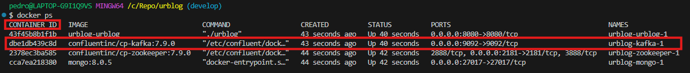

# UrBlog API

## Descripción

UrBlog es una API escrita en Golang 1.24 que aplica la arquitectura hexagonal (Ports & Adapters). La API permite publicar tweets, seguir a otros usuarios y obtener un timeline de tweets de los usuarios seguidos.

## Casos de Uso

1. **Publicar un tweet**
    - Entrada: ID del usuario y contenido del tweet (máximo 280 caracteres).
    - Salida: Confirmación y detalles del tweet (ID, usuario, contenido, timestamp).

2. **Seguir a otro usuario**
    - Entrada: ID del usuario que sigue y ID del usuario a seguir.
    - Salida: Confirmación y lista actualizada de seguidos.

3. **Obtener el timeline**
    - Entrada: ID del usuario y parámetros de paginación (limit, offset).
    - Salida: Lista de tweets de los usuarios seguidos, ordenados del más reciente al más antiguo.

## Estructura del Proyecto

```plaintext
urblog/
├── cmd/
│   ├── dependencies.go
│   ├── main.go
│   ├── routes.go
│   └── server.go
├── docs/
│   └── swagger.yaml
├── application/
│   ├── load_users.go
│   ├── load_users_test.go
│   ├── post_tweet.go
│   ├── post_tweet_test.go
│   ├── follow_user.go
│   ├── follow_user_test.go
│   ├── get_timeline.go
│   └── get_timeline_test.go
├── infrastructure/
│   ├── db/
│   │   ├── in_memory/
│   │   │   └── in_memory_user_repository.go
│   │   └── mongo/
│   │       └── mongo_user_repository.go
│   └── queue/
│       ├── in_memory/
│       │   └── in_memory_queue.go
│       └── kafka/
│           └── kafka_queue.go
├── interfaces/
│   ├── user_controller.go
│   └── user_controller_test.go
├── domain/
│   ├── tweet.go
│   └── user.go
├── go.mod
├── go.sum
└── README.md
```

- `cmd/`: Contiene el punto de entrada de la aplicación y la configuración del servidor.
- `docs/`: Contiene la documentación de Swagger para la API.
- `application/`: Contiene la lógica de negocio y los casos de uso de la aplicación.
- `infrastructure/`: Contiene la implementación de la infraestructura, como la conexión a bases de datos y la configuración de Kafka.
- `interfaces/`: Contiene los controladores que manejan las solicitudes HTTP.
- `repositories/`: Contiene la implementación de los repositorios para acceder a los datos.
- `domain/`: Contiene las entidades de dominio y las reglas de negocio.

## Arquitectura


## Configuración

Este proyecto utiliza Docker para orquestar un entorno de desarrollo con Kafka, Zookeeper y MongoDB. A continuación, se proporcionan instrucciones paso a paso para configurar y ejecutar el proyecto, incluyendo la creación de un topic en Kafka.

### Requisitos

- Docker
- Docker Compose

### Pasos

1. **Clonar el repositorio**

   ```sh
   git clone https://github.com/pedro00627/urblog/
   cd urblog
   ```

2. **Verificar que el servicio de Docker está activo**

   #### En Linux (Debian)

   Asegúrate de que el servicio de Docker se esté ejecutando con el siguiente comando:

   ```sh
   sudo systemctl status docker
   ```

   Si el servicio no está activo, inicia Docker con:

   ```sh
   sudo systemctl start docker
   ```

   #### En macOS

   En macOS, Docker Desktop se debe iniciar desde el Launchpad o desde la carpeta de Aplicaciones. Verifica que Docker esté en ejecución buscando el ícono de Docker en la barra de menú.

   #### En Windows

   En Windows, Docker Desktop se debe iniciar desde el menú Inicio. Verifica que Docker esté en ejecución buscando el ícono de Docker en la bandeja del sistema.

3. **Eliminar contenedores y volúmenes existentes**

   Si anteriormente has creado contenedores, puede ser útil eliminarlos para comenzar de nuevo:

   ```sh
   docker-compose down -v
   ```

4. **Reconstruir y levantar los servicios**

   Ejecuta el siguiente comando para construir e iniciar los servicios:

   ```sh
   docker-compose up --build
   ```

5. **Verificar que los contenedores están en ejecución**

   Ejecuta el siguiente comando para listar los contenedores que se están ejecutando:

   ```sh
   docker ps
   ```

   Busca el contenedor que corresponda al servicio Kafka. El ID del contenedor es el valor que aparece en la primera columna de la salida del comando `docker ps`.

   

6. **Crear un topic en Kafka**

   Primero, accede al contenedor de Kafka con una sesión interactiva utilizando el ID del contenedor que obtuviste en el paso anterior:

   ```sh
   docker exec -it <kafka-container-id> sh
   ```

   Luego, crea el topic en Kafka utilizando el siguiente comando:

   ```sh
   /usr/bin/kafka-topics --create --topic tweets --partitions 1 --replication-factor 1 --if-not-exists --zookeeper zookeeper:2181
   ```

7. **Verificar los topics en Kafka**

   Lista los topics en Kafka para asegurarte de que el topic se ha creado correctamente:

   ```sh
   /usr/bin/kafka-topics --list --bootstrap-server localhost:9092
   ```

   Esto te mostrará todos los topics que existen actualmente en el broker.

### Nota sobre las Variables de Entorno

Si las variables de entorno `DATABASE` y `KAFKA_BROKER` en el archivo `docker-compose.yml` están vacías, la aplicación utilizará servicios en memoria. Esto es útil para pruebas y desarrollo local sin necesidad de configurar servicios externos.

## Testing

Para ejecutar las pruebas unitarias y de integración:

```sh
go test ./...
```

## Documentación OpenAPI/Swagger

La documentación de la API está disponible en el endpoint `/swagger`.

## Ejemplo de Consumo

### Publicar un Tweet

#### Petición

```sh
curl -X POST http://localhost:8080/tweets -H "Content-Type: application/json" -d '{
  "user_id": "user1",
  "content": "Hello, world!"
}'
```

#### Respuesta

```json
{
  "id": "unique-tweet-id",
  "user_id": "user1",
  "content": "Hello, world!",
  "timestamp": "2025-03-04T03:38:10Z"
}
```

### Seguir a Otro Usuario

#### Petición

```sh
curl -X POST http://localhost:8080/follow -H "Content-Type: application/json" -d '{
  "follower_id": "user1",
  "followee_id": "user2"
}'
```

#### Respuesta

```sh
HTTP/1.1 204 No Content
```

### Obtener el Timeline

#### Petición

```sh
curl -X GET http://localhost:8080/timeline -H "Content-Type: application/json" -d '{
  "user_id": "user1",
  "limit": 10,
  "offset": 0
}'
```

#### Respuesta

```json
[
  {
    "id": "tweet1",
    "user_id": "user2",
    "content": "Tweet from user2",
    "timestamp": "2025-03-04T03:38:10Z"
  }
]
```

### Cargar Usuarios desde un Archivo CSV
#### Descripción
Este endpoint permite cargar usuarios desde un archivo CSV. Cada línea del archivo debe contener el nombre de usuario seguido de los nombres de usuario que sigue, separados por comas.

#### Formato del Archivo CSV
#### Petición
```sh
curl -X POST http://localhost:8080/load-users?file=docs/users.csv
```
#### Respuesta
```json
[
   {
      "ID": "user1",
      "Username": "user1",
      "Following": {
         "user2": true,
         "user3": true
      }
   },
   {
      "ID": "user2",
      "Username": "user2",
      "Following": {
         "user1": true
      }
   },
   {
      "ID": "user3",
      "Username": "user3",
      "Following": {
         "user1": true,
         "user2": true
      }
   },
   {
      "ID": "user4",
      "Username": "user4",
      "Following": {
         "user1": true,
         "user2": true,
         "user3": true
      }
   },
   {
      "ID": "user5",
      "Username": "user5",
      "Following": {
         "user4": true
      }
   }
]
```
#### Ejemplo de Archivo CSV
```csv
user1,user2,user3
user2,user1
user3,user1,user2
user4,user1,user2,user3
user5,user4
```

Este archivo CSV cargará cinco usuarios (user1, user2, user3, user4 y user5) y establecerá las relaciones de seguimiento entre ellos.

#### Notas
Asegúrate de que el archivo CSV esté correctamente formateado.
El endpoint /load-users espera la ruta del archivo CSV como un parámetro de consulta (file).
Para la carga de los usuarios, el id del usuario es el mismo que el nombre de usuario (por simplicidad para la gestion de los seguidores).